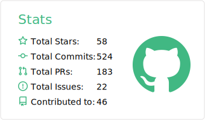
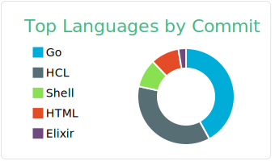

### :pencil2: Latest Blog Posts
<!-- BLOG-POST-LIST:START -->
- [Software Engineering Values that Everyone Should Practice](https://levelup.gitconnected.com/software-engineering-values-that-everyone-should-practice-c980d00cd103?source=rss-5763b0f1aba6------2)
- [Fastest PostgreSQL Client Library for Go](https://levelup.gitconnected.com/fastest-postgresql-client-library-for-go-579fa97909fb?source=rss-5763b0f1aba6------2)
- [How to Setup Grafana Loki for Free Log Management](https://levelup.gitconnected.com/how-to-setup-grafana-loki-for-free-log-management-ceb60558503c?source=rss-5763b0f1aba6------2)
- [Fastest Redis Client Library for Go](https://levelup.gitconnected.com/fastest-redis-client-library-for-go-7993f618f5ab?source=rss-5763b0f1aba6------2)
- [Tutorial: Generate Swagger Specification and SwaggerUI for Go Fiber Web Framework](https://medium.com/geekculture/tutorial-generate-swagger-specification-and-swaggerui-for-go-fiber-web-framework-6c787d1672de?source=rss-5763b0f1aba6------2)
<!-- BLOG-POST-LIST:END -->

### 📊 Weekly Coding Activity
<!--START_SECTION:waka-->
```text
Go      18 hrs 24 mins  ███████████████▒░░░░░░░░░   61.91 % 
YAML    4 hrs 18 mins   ███▓░░░░░░░░░░░░░░░░░░░░░   14.48 % 
JSON    2 hrs 24 mins   ██░░░░░░░░░░░░░░░░░░░░░░░   08.07 % 
Bash    1 hr 25 mins    █▒░░░░░░░░░░░░░░░░░░░░░░░   04.81 % 
Other   1 hr 14 mins    █░░░░░░░░░░░░░░░░░░░░░░░░   04.18 % 
```
<!--END_SECTION:waka-->
