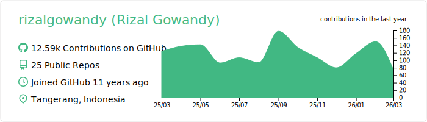

### :pencil2: Latest Blog Posts
<!-- BLOG-POST-LIST:START -->
- [Docker Compose for Amazon DynamoDB with Migration, Seeding, and Admin UI](https://medium.com/geekculture/docker-compose-for-amazon-dynamodb-with-migration-seeding-and-admin-ui-db11a348cc6a?source=rss-5763b0f1aba6------2)
- [Software Engineering Values that Everyone Should Practice](https://levelup.gitconnected.com/software-engineering-values-that-everyone-should-practice-c980d00cd103?source=rss-5763b0f1aba6------2)
- [Fastest PostgreSQL Client Library for Go](https://levelup.gitconnected.com/fastest-postgresql-client-library-for-go-579fa97909fb?source=rss-5763b0f1aba6------2)
- [How to Setup Grafana Loki for Free Log Management](https://levelup.gitconnected.com/how-to-setup-grafana-loki-for-free-log-management-ceb60558503c?source=rss-5763b0f1aba6------2)
- [Fastest Redis Client Library for Go](https://levelup.gitconnected.com/fastest-redis-client-library-for-go-7993f618f5ab?source=rss-5763b0f1aba6------2)
<!-- BLOG-POST-LIST:END -->

### 📊 Weekly Coding Activity
<!--START_SECTION:waka-->

```txt
Go             14 hrs 58 mins  ██████████████████▓░░░░░░   74.13 %
CSV            1 hr 22 mins    █▓░░░░░░░░░░░░░░░░░░░░░░░   06.84 %
YAML           1 hr 19 mins    █▓░░░░░░░░░░░░░░░░░░░░░░░   06.54 %
JSON           42 mins         █░░░░░░░░░░░░░░░░░░░░░░░░   03.47 %
Bash           33 mins         ▓░░░░░░░░░░░░░░░░░░░░░░░░   02.76 %
```

<!--END_SECTION:waka-->
