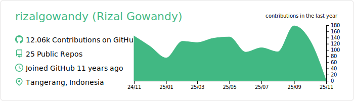

### :pencil2: Latest Blog Posts
<!-- BLOG-POST-LIST:START -->
- [Fastest Redis Client Library for Go](https://levelup.gitconnected.com/fastest-redis-client-library-for-go-7993f618f5ab?source=rss-5763b0f1aba6------2)
- [Tutorial: Generate Swagger Specification and SwaggerUI for Go Fiber Web Framework](https://medium.com/geekculture/tutorial-generate-swagger-specification-and-swaggerui-for-go-fiber-web-framework-6c787d1672de?source=rss-5763b0f1aba6------2)
- [Tutorial: Generate Swagger Specification and SwaggerUI for Gin Go Web Framework](https://levelup.gitconnected.com/tutorial-generate-swagger-specification-and-swaggerui-for-gin-go-web-framework-9f0c038483b5?source=rss-5763b0f1aba6------2)
- [Why You Should Graduate from Using Auto-Increment ID for Database Record?](https://rizalgowandy.medium.com/why-you-should-graduate-from-using-auto-increment-id-for-database-record-1c1f584e958a?source=rss-5763b0f1aba6------2)
- [How to Calculate Server Max Requests per Second](https://rizalgowandy.medium.com/how-to-calculate-server-max-requests-per-second-38a39bb96a85?source=rss-5763b0f1aba6------2)
<!-- BLOG-POST-LIST:END -->

### 📊 Weekly Coding Activity
<!--START_SECTION:waka-->
```text
Go           26 hrs 27 mins  ████████████████████▓░░░░   82.74 % 
JSON         1 hr 27 mins    █░░░░░░░░░░░░░░░░░░░░░░░░   04.55 % 
YAML         1 hr 7 mins     █░░░░░░░░░░░░░░░░░░░░░░░░   03.53 % 
SQL          57 mins         ▓░░░░░░░░░░░░░░░░░░░░░░░░   02.97 % 
Git Config   22 mins         ▒░░░░░░░░░░░░░░░░░░░░░░░░   01.18 % 
```
<!--END_SECTION:waka-->
