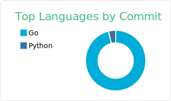

### :pencil2: Latest Blog Posts
<!-- BLOG-POST-LIST:START -->
- [Why You Should Graduate from Using Auto-Increment ID for Database Record?](https://rizalgowandy.medium.com/why-you-should-graduate-from-using-auto-increment-id-for-database-record-1c1f584e958a?source=rss-5763b0f1aba6------2)
- [How to Calculate Server Max Requests per Second](https://rizalgowandy.medium.com/how-to-calculate-server-max-requests-per-second-38a39bb96a85?source=rss-5763b0f1aba6------2)
- [Performance Matters: N+1 Problem](https://rizalgowandy.medium.com/performance-matters-n-1-problem-a6a072525149?source=rss-5763b0f1aba6------2)
- [Go Mod Cheat Sheet](https://rizalgowandy.medium.com/go-mod-cheat-sheet-2a79efc10a52?source=rss-5763b0f1aba6------2)
- [Tutorial: Generate Swagger Specification and SwaggerUI for Echo Go Web Framework](https://rizalgowandy.medium.com/tutorial-generate-swagger-specification-and-swaggerui-for-echo-go-web-framework-3ac33afc77e2?source=rss-5763b0f1aba6------2)
<!-- BLOG-POST-LIST:END -->

### 📊 Weekly Coding Activity
<!--START_SECTION:waka-->
```text
Go         29 hrs 5 mins   ██████████████████▒░░░░░░   73.54 % 
Markdown   1 hr 43 mins    █░░░░░░░░░░░░░░░░░░░░░░░░   04.38 % 
YAML       1 hr 42 mins    █░░░░░░░░░░░░░░░░░░░░░░░░   04.34 % 
Other      1 hr 24 mins    █░░░░░░░░░░░░░░░░░░░░░░░░   03.56 % 
JSON       1 hr 15 mins    ▓░░░░░░░░░░░░░░░░░░░░░░░░   03.18 % 
```
<!--END_SECTION:waka-->
